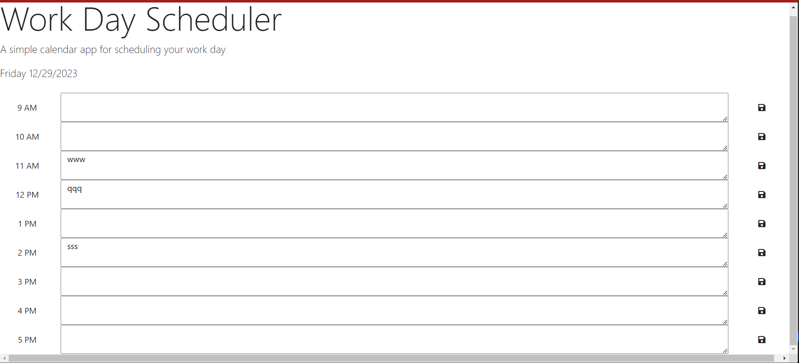

# Work_Day_Schedule

## Description
This is a a schedule for your 9-5 work schedule. The application highlights which hours have past. Which current hour you are currently in, and future events that have not happened yet. The app also has the capability of saving your schedule and storing it to the local storage on the browser so your schedule will not be lost when the app is closed.

## Repository
https://github.com/magellanrose/Work_Day_Schedule/tree/main

## Installation
Html, Css, and Javascript.

## License
MIT license

# Mock-Up

# Credits
I used the Rutgers bootcamp resources and the Xpert Learning Assistant.